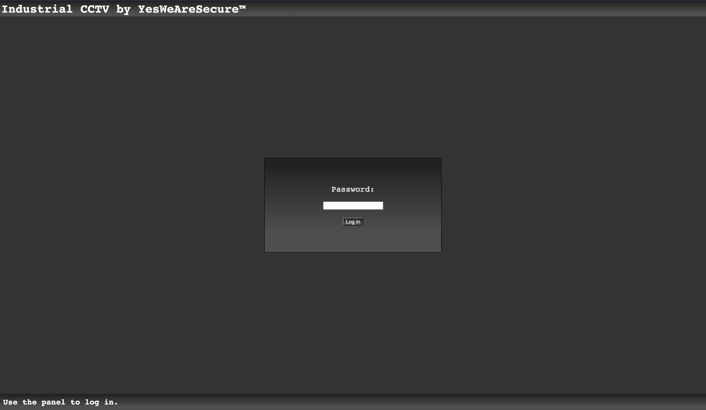
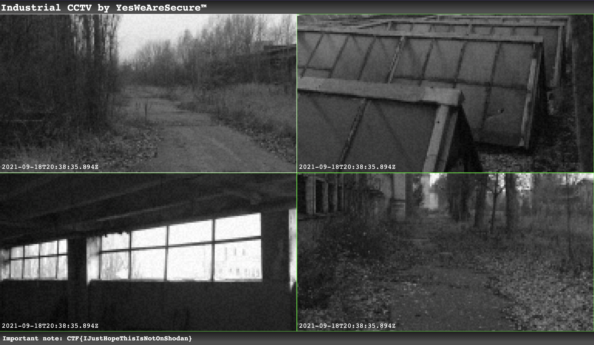

# Challenge #1 - CCTV

Category: `rev`

## Story

>"You must wonder why we have summoned you, AGENT? It has come to our attention that something terrible is about to take place. There is still time to prevent the disaster, and we could not think of anyone more suited for this task than you. We believe that if you can’t solve this quest, neither can anybody else. You have to travel to Novosibirsk, and investigate a suspicious chemical plant. This mission must be executed in secrecy. It’s classified, and it regards the safety of the whole world, therefore we can’t tell you anything more just yet. Go now, you have the fate of the world in your hands."<br/><br/>
>You arrive at your destination. The weather isn't great, so you figure there's no reason to stay outside and you make your way to one of the buildings. No one bothered you so far, so you decide to play it bold - you make yourself a cup of coffee in the social area like you totally belong here and proceed to find an empty room with a desk and a chair. You pull out our laptop, hook it up to the Ethernet socket in the wall, and quickly find an internal CCTV panel - that's a way better way to look around unnoticed. Only problem is... it wants a password.

## Solution

This challenge starts off by pointing you to `https://cctv-web.2021.ctfcompetition.com/`. You are met with a login page.



My first thought was to test for SQL Injection or XSS, but I realized that's jumping too far ahead and I went to explore the elements of the page, like the HTML and JavaScript.

I'm using Chrome, so I opened the Dev Tools panel. There's no JavaScript included, at least not as a separate file. The HTML is pretty unsurprising, it's just a login form with some basic CSS. However, at the bottom is this JavaScript block:

```html
<script>
const checkPassword = () => {
  const v = document.getElementById("password").value;
  const p = Array.from(v).map(a => 0xCafe + a.charCodeAt(0));

  if(p[0] === 52037 &&
     p[6] === 52081 &&
     p[5] === 52063 &&
     p[1] === 52077 &&
     p[9] === 52077 &&
     p[10] === 52080 &&
     p[4] === 52046 &&
     p[3] === 52066 &&
     p[8] === 52085 &&
     p[7] === 52081 &&
     p[2] === 52077 &&
     p[11] === 52066) {
    window.location.replace(v + ".html");
  } else {
    alert("Wrong password!");
  }
}

window.addEventListener("DOMContentLoaded", () => {
  document.getElementById("go").addEventListener("click", checkPassword);
  document.getElementById("password").addEventListener("keydown", e => {
    if (e.keyCode === 13) {
      checkPassword();
    }
  });
}, false);
</script>
```

Hmm, that looks highly suspicious. So what's happening here?

I don't see any API calls being made at all. It registers a listener which will modify the entered password and check it against some static values, and if they are correct, it will redirect to a page that presumably contains the flag.

None of the modifications are irreversible:

* [`Array.from()`](https://developer.mozilla.org/en-US/docs/Web/JavaScript/Reference/Global_Objects/Array/from) simply turns a string into an array of characters.
* `0xCafe +` adds a static value, which can be subtracted.
* [`String.prototype.charCodeAt()`](https://developer.mozilla.org/en-US/docs/Web/JavaScript/Reference/Global_Objects/String/charCodeAt) has the complementary function [`String.fromCharCode()`](https://developer.mozilla.org/en-US/docs/Web/JavaScript/Reference/Global_Objects/String/fromCharCode), found in the "See also" section.
* The lines in the if statement check characters out of order but this can be corrected.

I went with the simplest solution and manually ran the following JavaScript in the Dev Tools console:

```js
> var key = [52037, 52077, 52077, 52066, 52046, 52063, 52081, 52081, 52085, 52077, 52080, 52066];
> console.log(key.map(a => String.fromCharCode(a - 0xCafe)).join(''))
GoodPassword
```

This works! Logging in with this password takes you to a mock CCTV page:



At the bottom is our flag:

```
CTF{IJustHopeThisIsNotOnShodan}
```
