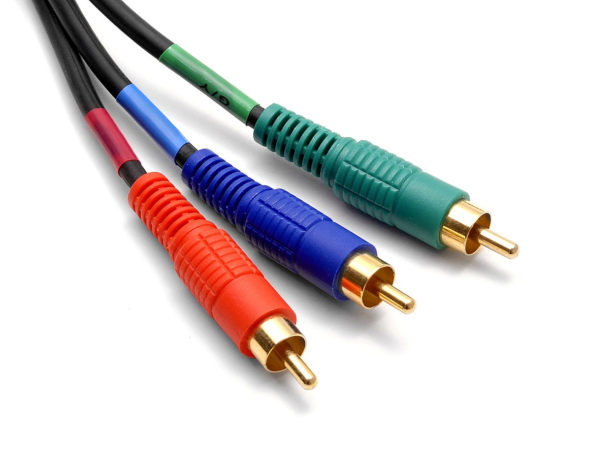
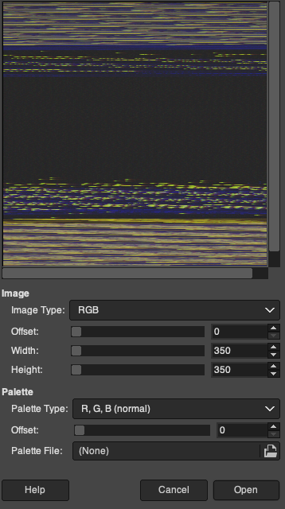
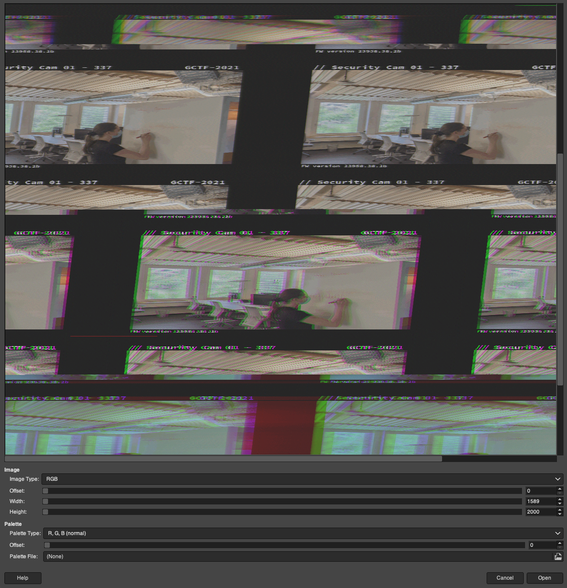
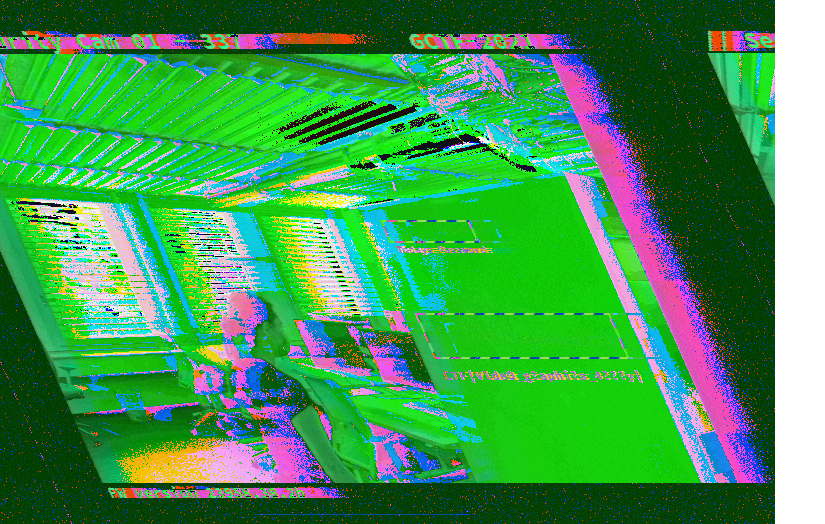

# Challenge #10 - Spycam

Category: `hardware`

## Story

>New York is hot, and you are on your way to the office complex. It seems like it is well guarded, even though you are expected under the alias of the assassin, perhaps it will be a better idea to sneak inside the building, unseen? You climb through a window on the side of the building. Inside you spot more guards, quick, hide behind a desk. Now you have to sneak past the guards into the main office.<br/><br/>
>You manage to find some exposed wires and quickly hook them up to your portable terminal. It seems to be a live feed of the internal CCTV system. If you can manage to decode the signal you might find something interesting, maybe a code or a password to get past the locked door.

## Solution

*Note: I'll freely admit this is the challenge I understood the least. Conceptually I think I get what's supposed to be done, but in practice I could only solve it with the help of Discord buddies.*

This challenge comes with a download link. Let's fetch it and examine it:

```sh
$ wget -O spycam.zip https://storage.googleapis.com/gctf-2021-attachments-project/c153d94221901baaba0eea8fbf6239be785741f5dd61aad22ba05cd862578b1b8cf04e7ebb9251f5a118f75ea567ae51cd37029c967f7dbff40c6453d38974dc
$ unzip spycam.zip
Archive:  spycam.zip
 extracting: chall.tar.gz
$ tar -tvzf chall.tar.gz
-rw-r--r-- chief/chief 25451543 2021-08-23 04:52 1.csv
-rw-r--r-- chief/chief 25723209 2021-08-23 04:52 2.csv
-rw-r--r-- chief/chief 25388488 2021-08-23 04:52 3.csv
-rw-r--r-- chief/chief 25078780 2021-08-23 04:52 4.csv
-rw-r--r-- chief/chief 25194368 2021-08-23 04:52 5.csv
-rw-r--r-- chief/chief 25223228 2021-08-23 04:52 6.csv
-rw-r--r-- chief/chief 25287005 2021-08-23 04:52 7.csv
```

Let's look at the files and see what we're dealing with.

On the surface we have precious few clues to go on. The story suggests we're connected to a live feed from a CCTV system, but all we have is some CSV files. Let's examine one at random:

```
$ head 1.csv
-0.0018051198211097765,4.25,-0.05,-0.05,-0.18
-0.001805079821043734,4.25,-0.05,-0.08,-0.18
-0.0018050398209776917,4.3,-0.05,-0.08,-0.18
-0.0018049998209116493,4.3,-0.05,-0.08,-0.18
-0.0018049598208456068,4.25,-0.05,-0.08,-0.2
-0.0018049198207795644,4.25,-0.05,-0.05,-0.18
-0.001804879820713522,4.25,-0.05,-0.05,-0.18
-0.0018048398206474796,4.25,-0.05,-0.08,-0.18
-0.001804799820581439,4.25,-0.05,-0.05,-0.18
-0.0018047598205153965,4.25,-0.05,-0.08,-0.18
$ wc -l *.csv
   600255 1.csv
   600255 2.csv
   600255 3.csv
   600255 4.csv
   600255 5.csv
   600255 6.csv
   600255 7.csv
  4201785 total
```

So we have hundreds of thousands of lines of seemingly random decimals. Could this be a video signal?

### Looking for patterns

Let's try to see some patterns.

The first field seems obviously different from the rest. It's a float with much higher precision, and in each file it is strictly increasing from top to bottom. In fact, the values may well be the same in each file:

```sh
$ diff <(cat 1.csv | cut -d, -f1) <(cat 2.csv | cut -d, -f1)
$
```

The second column is also different, It seems to range up to above 4.0:

```sh
$ cat *.csv | cut -d, -f2 | sort -n | uniq -c
      1 -0.35
      1 -0.25
      1 0.0
      1 0.15
      5 0.25
      4 0.3
     70 0.35
  20929 0.4
   1219 0.45
      6 0.5
      4 0.55
      1 0.65
      2 0.7
      1 2.4
      1 3.8
      1 3.9
      2 4.0
     50 4.05
   9521 4.1
 585527 4.15
   6828 4.2
1682057 4.25
1891911 4.3
   3608 4.35
     29 4.4
      1 4.45
      1 4.55
      1 4.6
      2 4.8
      1 4.85
```

There's also a clear distribution, with the vast majority of values around 4.05-4.35, and another big group around 0.4

What about the last 3 fields? They seem pretty similar to each other.

```sh
$ cat <(cat *.csv | cut -d, -f3) <(cat *.csv | cut -d, -f4) <(cat *.csv | cut -d, -f5) | sort -n | uniq -c
      5 -0.43
    132 -0.4
  14901 -0.38
3071441 -0.35
1123721 -0.33
 324364 -0.3
 267011 -0.28
 285149 -0.25
 306693 -0.23
 308461 -0.2
 321089 -0.18
 339726 -0.15
 338315 -0.12
 405376 -0.1
 473281 -0.08
 541196 -0.05
 598085 -0.03
 638254 0.0
      1 0.0-0.0018051198211097765
 703931 0.02
 664505 0.05
 561624 0.07
      1 0.07-0.0018051198211097765
 378343 0.1
      1 0.1-0.0018051198211097765
 257990 0.12
 217705 0.15
      1 0.15-0.0018051198211097765
 154734 0.18
      1 0.18-0.0018051198211097765
 110082 0.2
 100187 0.22
  84386 0.25
      1 0.25-0.0018051198211097765
  14649 0.28
     16 0.3
```

They pretty clearly follow a similar distribution. This is a bit of a guess but probably the range is -0.5 to 0.5.

### Decoding the signal

I still don't have a real clue what this is, but the fact that it's video feed with 3 similar channels make me think of those old school RGB cables.



I'm not a graphics or hardware person at all. I'm wholly unfamiliar with standards or protocols for transferring video. But it's not unreasonable to assume that maybe those last 3 "channels" are (0,255) style RGB values except normalized to a random float range for some hardware-related reason. Let's try to verify that guess.

We'll normalize the values from (-0.5,0.5) to (0,255) with a little Python script ([convert_to_rgb_simple.py](convert_to_rgb_simple.py)):

```python
'''
Try to treat the last 3 streams as "raw image data" for GIMP.

For GIMP, a .data file is literally the bytes in order of RGB RGB RGB ...

So, try to convert the last 3 streams of the CSV to RGB bytes and load into GIMP.
'''

# Normalize the range of -0.5 to 0.5
# See https://stackoverflow.com/a/929107
def normalize(color_val):
  return int((float(color_val) + 0.5) * 255)

# Process stdin
with open(f'all.data', 'wb') as allf:
  for i in range(1,8):
    with open(f'{i}.csv', 'r') as f:
      lines = f.readlines()

    for line in lines:
      line = line.strip()
      _, _, R, G, B = line.split(',')

      # Normalize
      R, G, B = normalize(R), normalize(G), normalize(B)

      # Write the bytes as RGB in order.
      allf.write(R.to_bytes(1, byteorder='little', signed=False))
      allf.write(G.to_bytes(1, byteorder='little', signed=False))
      allf.write(B.to_bytes(1, byteorder='little', signed=False))
```

The values are written out as plain bytes, since I'm using GIMP and it supports loading [raw image data](https://stackoverflow.com/a/32393367). Of course, since it doesn't have width or height information, we'll have to adjust that manually until we get something that looks like a picture.

Here's the original:



And here it is after fiddling with the width and height for a while:



So there is definitely something here! Our intuition is correct, even if the conversion and normalization is clearly not exactly right.

### Decoding the video feed

I can't really make out much in these frames. With zooming in, all I can see written on the board is this:

```
CTF{V1de0G
```

Which looks like English. It's "video g\<something\>".
 
At this point I have to admit that I was stuck, until a helpful stranger on Discord showed me this version of the video feed that they had somehow construed (my best attempt at recording their approach is in [convert_to_rgb.py](convert_to_rgb.py)):



I didn't add the OCR, that's just part of the image. It gives a huge clue, suggesting that what's written on the board is this:

```
CTF|V1de0_g?aphi?s_4???y|
```

Now obviously some of that is wrong. For one, `CTF||` should be `CTF{}`. For another, we could make out that the 'g' is actually uppercase 'G'. So let's treat this as just a clue.

Clearly this is written in [leetspeak](https://en.wikipedia.org/wiki/Leet). I'm not sure how you'd intuit this without already knowing about it, except by squinting and seeing that a "4" kind of looks like an "A", a "0" kind of looks like an "o", etc.

### Guessing the flag

So the flag is some variation of "Video_Graphics_Array", which gives the final clue - this signal was probably [VGA](https://en.wikipedia.org/wiki/Video_Graphics_Array). But at this point I'm not going to write or find a VGA decoder, we can just make educated guesses.

How? Well:

* There's no common leet equivalent for 'c' or 'r'. Those are probably just 'c' and 'r'.
* The letters look like they're lowercase except the first letter, like an acronym. So let's assume lowercase 'c' and 'r'.
* The first 'g' is actually 'G'.
* The 'a' in "array" could be an "a" or a "4".

We're left with very few probable variations. Sure enough we find the flag on the second try.

```
CTF{V1de0_Graphics_4rr4y}
```
