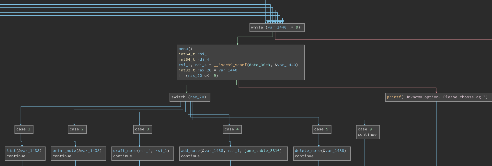
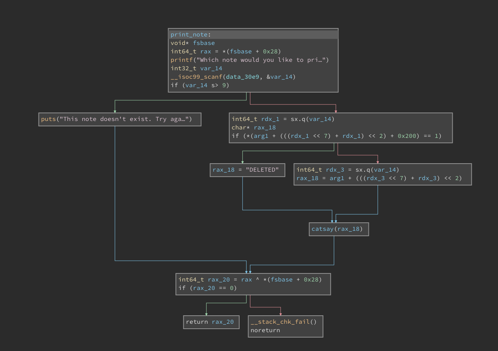
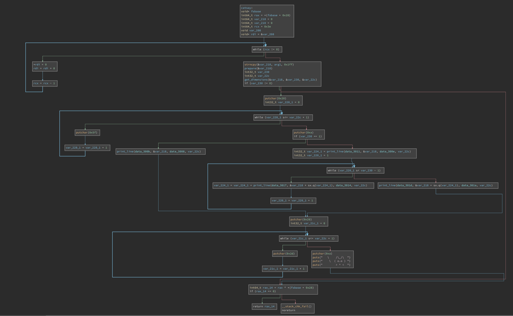
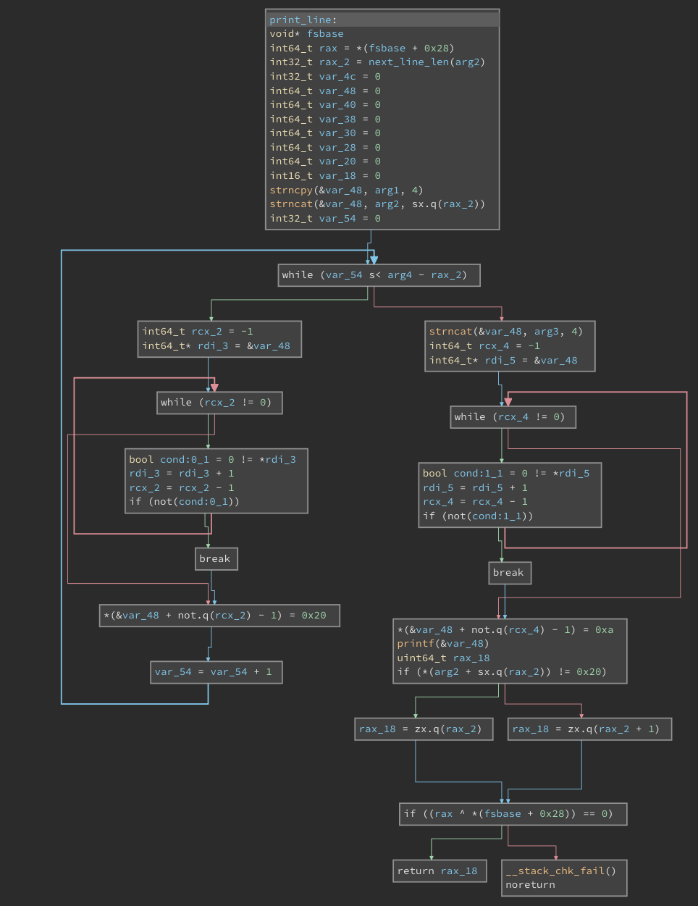

# Challenge #11 - Notebook

Category: `pwn`

## Story

>Wow, it’s a crowded day at Heathrow, lots of suits that bump into each other and try to catch their plane. You have to find the gate to the secret warehouse, it cannot be far away. You see a suspicious suit go into a fast food court and you spot him disappear behind the checkout. Hmmm, odd?! You follow, and when no one sees you follow him. You go through a desolate kitchen. It stinks, you cover your nose with the back of your hand. You pass through a small entrance, and enter the secret warehouse, wow, it’s vast!<br/><br/>
>Please help me restore my deleted note.

## Solution

This challenge comes with a URL and a port. We can connect to it with [netcat](https://en.wikipedia.org/wiki/Netcat) (see [connect.sh](connect.sh)):

```sh
$ nc pwn-notebook.2021.ctfcompetition.com 1337
```

It also comes with a download link. Let's fetch it and examine it:

```sh
$ wget -O notebook.zip https://storage.googleapis.com/gctf-2021-attachments-project/6c96641ce301c1cce0638c706ce6f08e03dd07a7206f13502814948b87956797cbfab4e5319df21bc2bed99834bd7aede661f86a8a0d5c7148c3158d566afc68
$ unzip notebook.zip
Archive:  notebook.zip
 extracting: notebook
```

We have a single binary and no source code. Presumably that's the same binary running at the address above.

Since we're not given source code, there's really only two ways to approach this kind of challenge:

1. Interact with the binary or the hosted service, try different inputs and observe the effects (**dynamic analysis**).
1. [Disassemble](https://en.wikipedia.org/wiki/Disassembler) or [decompile](https://en.wikipedia.org/wiki/Decompiler) the binary and try to make sense of the assembly code (**static analysis**).

We're going to do both, since they can each give us tons of information.

### Dynamic analysis

What does the service even do?

```sh
$ ./connect.sh
== proof-of-work: disabled ==
This is your confidential notebook.
This should get you through the next mission!
Good luck!

Please choose what you want to do:
1. List built-in note metadata.
2. Print out a built-in note.
3. Make a draft your note.
4. Add note to notebook.
5. Delete note.
9. Quit.
> 1
Here's a list of our notes:
 - 00. length: 037, state: LIVE
 - 01. length: 038, state: LIVE
 - 02. length: 055, state: LIVE
 - 03. length: 040, state: DELETED
 - 04. length: 044, state: LIVE
 - 05. length: 000, state: DELETED
 - 06. length: 000, state: DELETED
 - 07. length: 000, state: DELETED
 - 08. length: 000, state: DELETED
 - 09. length: 000, state: DELETED
```

There are some notes, pre-populated. The story asked us to restore the DELETED note. There are 6 of them, but notes 5-9 have length 0 and note 3 has length 40, so that's our target.

How does printing a note work?

```sh
> 2
Which note would you like to print out? 3
 _________
< DELETED >
 ---------
   \    /\_/\
    \  ( o.o )
        > ^ <
> 2
Which note would you like to print out? 4
 __________________________________
/ Urgent: The delivery at 15:10 is \
\ prioritised                      /
 ----------------------------------
   \    /\_/\
    \  ( o.o )
        > ^ <
```

Nice, it draws a cat saying the note. Similar to [cowsay](https://en.wikipedia.org/wiki/Cowsay). Unsurprisingly, we can't print DELETED notes. There doesn't appear to be any form of authentication or access control.

What about the draft?

```sh
> 3
Quote: hello world !
 _______
< hello >
 -------
   \    /\_/\
    \  ( o.o )
        > ^ <
> Quote:  _______
< world >
 -------
   \    /\_/\
    \  ( o.o )
        > ^ <
> Quote:  ___
< ! >
 ---
   \    /\_/\
    \  ( o.o )
        > ^ <
```

That's pretty strange. It seems to split on spaces and catsay each individual word. It didn't affect any existing notes though.

Let's try deleting a deleted note:

```sh
> 5
Which note would you like to delete? 3
Deleted.
> 1
Here's a list of our notes:
 - 00. length: 037, state: LIVE
 - 01. length: 038, state: LIVE
 - 02. length: 055, state: LIVE
 - 03. length: 040, state: DELETED
 - 04. length: 044, state: LIVE
 - 05. length: 000, state: DELETED
 - 06. length: 000, state: DELETED
 - 07. length: 000, state: DELETED
 - 08. length: 000, state: DELETED
 - 09. length: 000, state: DELETED
```

Nothing changed, which is a little curious. Deleting doesn't erase the contents, since the length of note 3 is still 40.

What about adding a note?

```sh
> 4
Note: hello world
> 1
Here's a list of our notes:
 - 00. length: 037, state: LIVE
 - 01. length: 038, state: LIVE
 - 02. length: 055, state: LIVE
 - 03. length: 005, state: LIVE
 - 04. length: 044, state: LIVE
 - 05. length: 005, state: LIVE
 - 06. length: 000, state: DELETED
 - 07. length: 000, state: DELETED
 - 08. length: 000, state: DELETED
 - 09. length: 000, state: DELETED
> 2
Which note would you like to print out? 3
 _______
< hello >
 -------
   \    /\_/\
    \  ( o.o )
        > ^ <
```

This is interesting! The first note added takes the place of the earliest DELETED note, which happens to be our target! The length is changed, but maybe the contents aren't really overwritten. Let's remember this as a possible exploit vector.

### Trying weird inputs

Something always worth trying in `pwn` challenges is "bad" or unexpected inputs. Let's see how the binary handles some.

A negative choice selection (bounds bypass?):

```sh
> -1
Unknown option. Please choose again.
```

A very large number (integer overflow?):

```sh
> 2093482308402384092809348238508203850238908490230482083402380482390840238234890
Unknown option. Please choose again.
```

A very long string to print (buffer overflow?):

```sh
> 3
Quote: aaaaaaaaaaaaaaaaaaaaaaaaaaaaaaaaaaaaaaaaaaaaaaaaaaaaaaaaaaaaaaaaaaaaaaaaaaaaaaaaaaaaaaaaaaaaaaaaaaaaaaaaaaaaaaaaaaaaaaaaaaaaaaaaaaaaaaaaaaaaaaaaaaaaaaaaaaaaaaaaaaaaaaaaaaaaaaaaaaaaaaaaaaaaaaaaaaaa
 __________________________________________
/ aaaaaaaaaaaaaaaaaaaaaaaaaaaaaaaaaaaaaaaa \
| aaaaaaaaaaaaaaaaaaaaaaaaaaaaaaaaaaaaaaaa |
| aaaaaaaaaaaaaaaaaaaaaaaaaaaaaaaaaaaaaaaa |
| aaaaaaaaaaaaaaaaaaaaaaaaaaaaaaaaaaaaaaaa |
\ aaaaaaaaaaaaaaaaaaaaaaaaaaaaaaaaaaaa     /
 ------------------------------------------
   \    /\_/\
    \  ( o.o )
        > ^ <
```

Unprintable hex characters:

```sh
> 3
Quote: \xff\xff\xff\xe7
 __________________
< \xff\xff\xff\xe7 >
 ------------------
   \    /\_/\
    \  ( o.o )
        > ^ <
```

Symbols:

```sh
> 3
Quote: &%^$#@!
 _________
< &%^$#@! >
 ---------
   \    /\_/\
    \  ( o.o )
        > ^ <
```

Backslashes:

```sh
> 3
Quote: \
 ___
< \ >
 ---
   \    /\_/\
    \  ( o.o )
        > ^ <
> 3
Quote: \\
 ____
< \\ >
 ----
   \    /\_/\
    \  ( o.o )
        > ^ <
```

Oh well. Nothing of note so far. Let's take a small detour and try static analysis to see if we find more clues.

### Static analysis

The plainest kind of disassembly can be done like so:

```sh
$ objdump -drwC -M intel ./notebook
```

But that alone is going to be extremely hard to work with unless you're an experienced assembly developer. Even then, this isn't an ideal approach.

Much better for your sanity is to use a dedicated disassembly/reversing tool:

* [IDA Pro](https://hex-rays.com/ida-pro/) - I've heard great things about it but you need to be made of money to afford it (or work for a company with a money printer).
* [Ghidra](https://ghidra-sre.org/) - The free competitor to IDA Pro, made by the NSA. Many people's preferred choice and pretty full-featured.
* [radare2](https://github.com/radareorg/radare2) - Notable for working on the command-line. This can be fantastic if you're without a graphical environment, such as when `ssh`ing to another computer. I've heard it's great but quite hard to pick up.
* [cutter](https://cutter.re/) - Another nice free disassembler with a GUI. I'm not familiar with it.
* [Binary Ninja Cloud](https://cloud.binary.ninja/) - Free and notable for being a SaaS app, making it hugely convenient since you don't need to install anything.

Pick any of these, really. The hard part of learning reversing isn't the tools, it's developing the ability to conceptualize the lower-level code and understand it as higher-level operations, and that simply takes lots of practice and exposure, besides the requisite knowledge of how assembly works in general.

My choice at the moment is Binary Ninja Cloud. I just find it so convenient and its "High Level IL" representation is incredibly helpful.

It's really hard to capture the full reversing process, but I'll try to cover the broad strokes of what I did.

Let's first look at `main`.



This looks like the standard loop that asks for your command choice. It's nice that the function names were preserved and not obfuscated.

We could look at any of these but I'm going to start with `print_note` to see if maybe there's a way to bypass the "is DELETED" check.



There's not too much going on here. It only supports 9 notes. The line

```
(*(arg1 + (((rdx_1 << 7) + rdx_1) << 2) + 0x200)
```

is hard to read, but it's most likely accessing a field in a list of structs, with the input (`rdx_1`) used as the offset.

There's also `__stack_chk_fail()`. This sounds like [stack canary protection](https://en.wikipedia.org/wiki/Buffer_overflow_protection#Canaries), which we're not going to bypass easily (remember, this is "Beginners" Quest - the intended approach is supposed to be fairly easy).

There's also the curious function `catsay` (called it!). It's not a standard Linux command, so it's probably custom for this challenge. Let's look a bit deeper.



There's a lot going on here, but it boils down to the following:

* Calls `get_dimensions` to calculate the width of the text box.
* Calls `print_line` repeatedly to print the note.
* Prints an ASCII cat.
* Checks the stack canary.

At this point I had a hunch. Does `print_line` sanitize the input in any way?



Do you see it?

It's a bit hard to trace due to the calls to [`strncpy`](https://linux.die.net/man/3/strncpy) and [`strncat`](https://linux.die.net/man/3/strncat), but ultimately our input is passed unmodified to [`printf`](https://linux.die.net/man/3/printf). That's a classic indicator of a possible [format string vulnerability](https://en.wikipedia.org/wiki/Uncontrolled_format_string).

`print_line` is also called by `draft_note`, so we're going to use that, since it's a single action while `print_note` is 2 actions (`add_note`, `print_note`).

But does it work?

```
> 3
Quote: %p
 ____
< 0x562cab035008 >
 ----
   \    /\_/\
    \  ( o.o )
        > ^ <
```

Indeed it does!

### Exploiting format strings

Of the [formats available to us](https://en.wikipedia.org/wiki/Printf_format_string#Type_field), a few are notable:

* `%p` and `%x` let us print hex values directly from memory.
* `%n` will let us write to memory.

I'd kind of like to avoid the `%n` trick as I find it convoluted and tricky to get exactly right. But I have no doubt it's exploitable to un-delete our target note.

Instead let's see if we can print memory. This assumes the note is somewhere in memory AFTER the location of the code that's executing, but maybe we're lucky this way.

An important concept to understand here is the [parameter field](https://en.wikipedia.org/wiki/Printf_format_string#Parameter_field) in a format string. This lets us specify a specific argument to consume. For example, to print the 3rd arg as a pointer:

```
%3$p
```

With an unsanitized format string, the "arguments" are just the rest of memory. That means we can increase this field to print any section of memory. This might work!

As usual I followed the simplest solution. I wrote a script to generate commands that print 1 section of memory, pipe them into the service, and try to decode the hex as ASCII. See [dumpmemory.sh](dumpmemory.sh) and [gencommands.sh](gencommands.sh), as well as [dumpedmemory.txt](dumpedmemory.txt) for an example.

The output from running it is pretty difficult to read, but we do indeed get a very interesting group of values:

```sh
$ ./solve.sh
...
0x696d655200000000 -> Remi
0x5443203a7265646e -> nder: CT
0x74616d726f667b46 -> F{format
0x5f676e697274735f -> _string_
0x5f6568745f726f66 -> for_the_
0x7d6e6977 -> win}
...
```

This can be manually decoded by reading top-to-bottom (bytes were reversed by the script to account for [endianness](https://en.wikipedia.org/wiki/Endianness)) but is also automated in [solve.sh](solve.sh). This gets us the flag.

```
CTF{format_string_for_the_win}
```
