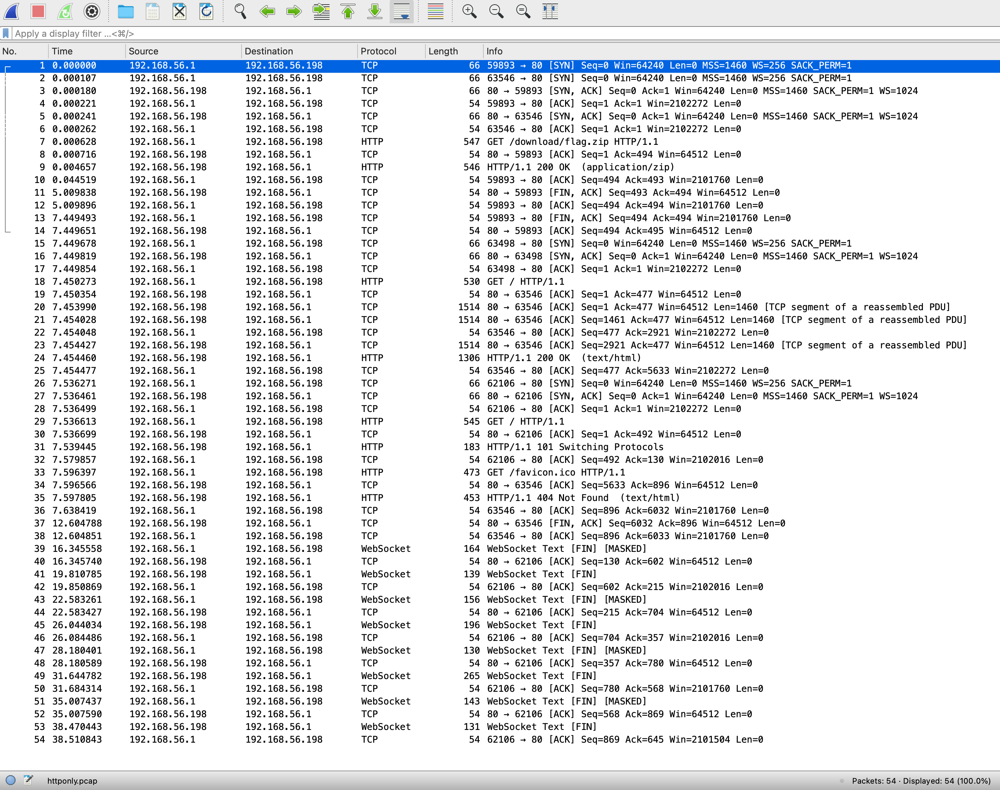
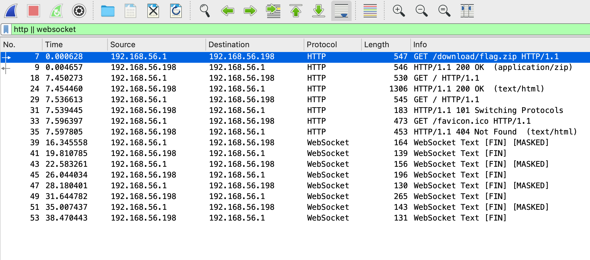
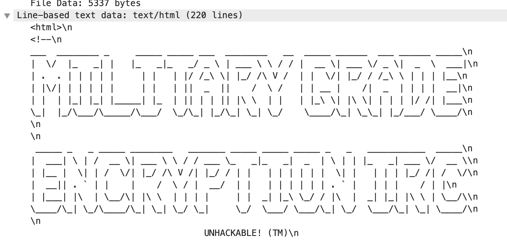
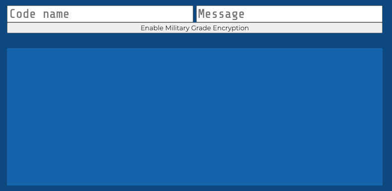

# Challenge #13: Noise on the Wire

Category: `net`

## Story

>That was close! The armed guard didn’t notice you. The floor shakes, the boat is leaving the harbor. You are trying to stay hidden. You see two guards coming your way, you sneak into a small scrubber, they pass it, but then one of the guards takes out his phone and says “OK Google” and your phone suddenly makes a noise: PLING! The guards heard it: Guard 1: "Did you hear that?" Guard 2: "It must have come from the scrubber" Guard 1: "Let's have a look!" The guards close in, you are trapped! Suddenly a bell rings in the distance, and a voice talks through speakers: "Every man to their positions, the ship is about to debark, I repeat, every man to their positions." The guards change their course and head for their positions. Pheww, that was close! You find a better place to hide and settle in for the journey. Then you notice an ethernet socket in the wall. Might as well sniff some traffic while you're here.<br/><br/>
>You connect your laptop to the ethernet socket and start wireshark. It taks a while before something interesting pops up - perhaps the crew as busy with whatever is that they normally do. You look through the packets, and hey, these look pretty interesting...

## Solution

This challenge comes with a download link. Let's fetch it and examine it:

```sh
$ wget -O noise-on-the-wire.zip https://storage.googleapis.com/gctf-2021-attachments-project/c857cf4543aafba2cd93b1d381088557ccc63e839c505310a8e212ecd8355a0b6fce3421ed822fb0cdb6c63d0aec9ef794c90ace6010695334816fab88b6a740
$ unzip noise-on-the-wire.zip
Archive:  noise-on-the-wire.zip
 extracting: httponly.pcap
```

Let's look at the files and see what we're dealing with.

We only have one [PCAP](https://www.reviversoft.com/en/file-extensions/pcap) file, containing captured network packets. The most common tool for analyzing this kind of file is [Wireshark](https://www.wireshark.org/), so we're going to be using that.

The file is called "httponly", which may be a reference to the [HttpOonly](https://owasp.org/www-community/HttpOnly) cookie flag. Let's keep that in mind in case it becomes useful.

Analyzing pcaps requires some understanding of computer networking and common protocols, such as the [OSI Model](https://en.wikipedia.org/wiki/OSI_model), [TCP/IP](https://en.wikipedia.org/wiki/Internet_protocol_suite), and the the [TCP Three-Way Handshake](https://en.wikipedia.org/wiki/Transmission_Control_Protocol#Connection_establishment). However, even just looking at the packet payload can often be enough.

*Note: This is much too broad of topic to cover here but the rest of this writeup does assume some basic knowledge of TCP/IP.*

Let's take an initial look:



We see a few things of note:

* A bunch of TCP SYNs and ACKs, probably just part of the standard session establishment.
* A few HTTP messages.
* A few [WebSocket](https://en.wikipedia.org/wiki/WebSocket) messages at the end.

The WebSocket wiki page says it uses the [HTTP Upgrade header](https://en.wikipedia.org/wiki/HTTP/1.1_Upgrade_header) to morph the connection, so it's reasonable to assume some of the HTTP packets were used to establish or initiate the WebSocket connection.

Let's filter out TCP and focus on the remaining protocols, using the following filter:

```
http || websocket
```



That seems small enough to look at packet-by-packet.

### The HTTP packets

Let's look at the HTTP packets, top to bottom.

```
GET /download/flag.zip HTTP/1.1\r\n
HTTP/1.1 200 OK\r\n
```

So they fetched a zip file with the flag. Let's extract the bytes and treat them like a zip file. In Wireshark, you can do this by right-clicking (or two-finger clicking) the the "Media Type" at the bottom of the second packet and choosing "Export Packet Bytes...". Let's try to unzip it.

```sh
$ file flag.bin
flag.bin: Zip archive data, at least v2.0 to extract
$ mv flag.bin flag.zip
$ unzip flag.zip
Archive:  flag.zip
[flag.zip] flag.txt password:
```

Drats, foiled. Let's move on.

```
GET / HTTP/1.1\r\n
HTTP/1.1 200 OK\r\n
```

Nice! This second request contains an HTML file, with a super scary "Stay out!" warning:



"Unhackable". Sure thing.

What does this page look like when you open the file?



You can seemingly encrypt messages.

More interesting are the JavaScript functions embedded in the page source:

```js
function encryptWithMilitaryGradeEncryption(text) {
  ...
}

function decryptWithMilitaryGradeEncryption(hexstr) {
  ...
}
```

We can probably just use these from the console. Let's move on with the last few packets.

```
GET / HTTP/1.1\r\n
HTTP/1.1 101 Switching Protocols\r\n
  Upgrade: websocket\r\n
  Connection: Upgrade\r\n
  Sec-WebSocket-Accept: qxA6c0bXwkHUXALTC5mfFrg8438=\r\n
GET /favicon.ico HTTP/1.1\r\n
GET /favicon.ico HTTP/1.1\r\n
```

The favicon GET is uninteresting, but the other packet confirms our suspicion: they've activated a WebSocket channel.

### The WebSocket packets

```
{"militaryGradeEncryption":false,"codename":"Goon8133","message":"what's the password to the zip file?"}
{"militaryGradeEncryption":false,"codename":"BadGuy87","message":"which zip file?"}
{"militaryGradeEncryption":false,"codename":"Goon8133","message":"well, you know, THE zip file"}
{"militaryGradeEncryption":false,"codename":"BadGuy87","message":"oh, that one... gimme a sec, need to turn on military grade encryption"}
{"militaryGradeEncryption":false,"codename":"Goon8133","message":"ok"}
{"militaryGradeEncryption":true,"codename":"BadGuy87","message":"717f510b44623d391016bd6464450c5e316d1a0c16b95f794d487a2719373000be4a54445843273f080216b97c795348642d19300a169d627a4d645634280c0c21a53a241218"}
{"militaryGradeEncryption":true,"codename":"Goon8133","message":"67794d0c452e3467"}
{"militaryGradeEncryption":true,"codename":"BadGuy87","message":"72734044"}
```

Let's plug the hashes in the last 3 messages into the decryption function on the webpage we extracted earlier. They translate to:

```
> decryptWithMilitaryGradeEncryption("717f510b44623d391016bd6464450c5e316d1a0c16b95f794d487a2719373000be4a54445843273f080216b97c795348642d19300a169d627a4d645634280c0c21a53a241218")
"zip's password is BossToldMeToSetABetterPasswordSoThisWillHaveToDo1234"
> decryptWithMilitaryGradeEncryption("67794d0c452e3467")
'lol rly?'
> decryptWithMilitaryGradeEncryption("72734044")
'yeah'
```

"Military-grade" indeed.

### Extracting the flag

Let's unzip the file:

```sh
$ unzip flag.zip
Archive:  flag.zip
[flag.zip] flag.txt password:
 extracting: flag.txt
```

And extract our flag.

```
CTF{PleaseAssumeThisIsSomeSecretStuffThankYou}
```
