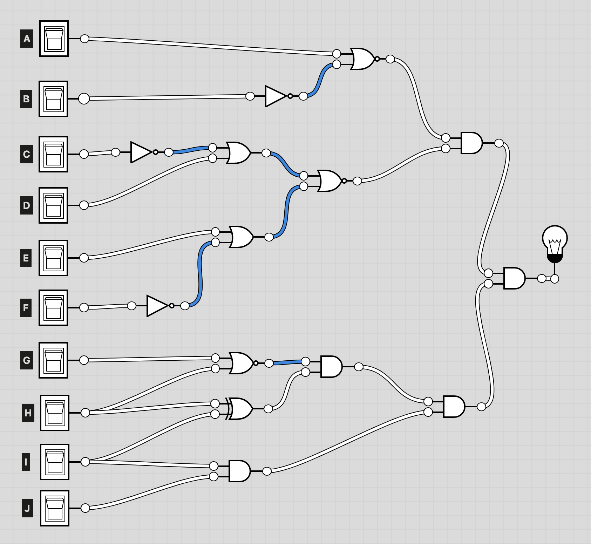

# Challenge #2 - Logic Lock

Category: `misc`

## Story
>It’s a cold day, and the snow is falling horizontally. It pierces your sight. You better use those extra pairs of socks that you were strangely given by the driver. Someone is waving on the other side of the street. You walk over to her. "Hi AGENT, I’m AGENT X, we’ve found the apartment of a person that we suspect got something to do with the mission. Come along!."<br/><br/>
>It turned out the suspect's appartment has an electronic lock. After analyzing the PCB and looking up the chips you come to the conclusion that it's just a set of logic gates!

## Solution

This challenge comes with a download link. Let's fetch it and examine it:

```sh
$ wget -O logic-lock.zip https://storage.googleapis.com/gctf-2021-attachments-project/419bcccb21e0773e1a7db7ddcb4d557c7d19b5a76cd421851d9e20ab451702b252de11e90d14c3992f14bb4c5b330ea5368f8c52eb1e4c8f82f153aea6566d56
$ unzip logic-lock.zip
Archive:  logic-lock.zip
 extracting: logic-lock.png
```

(the file is included in the repo in case the link ever goes down)

Let's look at the image:


It's a set of logic gates with the inputs labeled with the letters A-J. At the bottom it says that the flag is the inputs that need to be set, sorted and enclosed in `CTF{}`.

As usual, I'm going to go with the simplest solution and use https://logic.ly/ to build the circuit and play with the inputs. There are certainly other ways to solve this.

This is what the circuit looks like like:



From here, it's pretty easy to play around with each pair of inputs to determine what needs to be switched on. The final result is `BCFIJ`, which gives us the flag:

```
CTF{BCFIJ}
```
