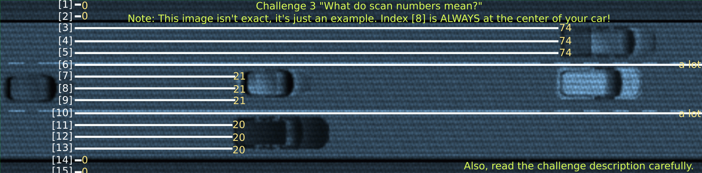

# Challenge #3 - High Speed chase

Category: `misc`

## Story
>The person drives into a narrow back alley and despite the danger you try to continue on and give chase. It is impossible to see who they are, clothed all in black and a helmet covering the face. You need to intercept them somehow.<br/><br/>
>You chase them through city streets until you reach the high way. The traffic is pretty rough for a car and you see them gaining ground - should have hotwired a motorbike as well! Too late for that. You look around your car to spot anything useful, and you notice this is actually one of the new self driving cars. You turn on the autopilot, pull out your laptop, connect it to the system, and enter the not-so-hidden developer's mode. It's time to re-program the autopilot to be a bit more useful in a chase! To make it easier, you replace the in-car LiDAR feed with a feed from an overhead sattelite - you also display it on the the entertainment system. Now all that's left to do, is to write a better controlCar function!

## Solution

This challenge sends you to https://high-speed-chase-web.2021.ctfcompetition.com/. The page is [included](car_interface.html) in this repo in case the link ever goes down.

You are presented with a top-down view of a highway and an area to write code. There are also instructions:

```
Car Self-Driving Interface

You need to re-implement the controlCar function.

To implement it in JavaScript use the editor on the left.

When implemented, controlCar function will be called several times per second during the chase to allow for
course corrections.

The controlCar function takes a single parameter – scanArray – which is an array containing 17 integers denoting
distance from your car to the nearest obstacle:

[indexes 0-7]: on the left side of the car (index 7 is the measurement at the left headlight),
[index 8]: at the center of the car,
[indexes 9-16]: on the right side of the car (index 9 is the measurement at the right headlight).
See also this image (it's not precise, but will give you an idea what you are looking at).

All measurements are parallel to each other.

A negative measurement might appear if the obstacle is very close behind our car.

The controlCar must return an integer denoting where the car should drive:

-1 (or any other negative value): drive more to the left,
0: continue straight / straighten up the car,
1 (or any other positive value): drive more to the right.
```

There's also this helper image:



This, along with the comment at the top of the page source, makes it clear that the intention is to write some code, not to reverse-engineer the source. A quick look through the JavaScript and a search for "flag" shows that the value, while embedded, is protected behind [SHA-256](https://en.wikipedia.org/wiki/SHA-2):

```js
async function validateSolution(s) {
  const enc = new TextEncoder();
  const k = enc.encode(s);

  const check = await sha256(k);
  if (check === "fe1784993d8f1b5feba69378ed6e684337c6da5864c9c8a77fb02ff29213f1be") {
    const flag = await sha1(k);
    return "CTF{" + flag + "}";
  }

  return false;
}
```

So let's try to solve it properly.

*You're welcome to try reversing/pwning it instead, as exercise.*

Trying the "Engage" button runs a visual simulation of your car moving, which is really useful as it helps you visualize what might be going wrong. It also allows you to reset, so you can try as many times as you'd like.

Let's think through the cases we need to handle:

* We need to move if all 3 indexes in "front" of the car show an obstacle. Only considering the middle means the left or right headlight might hit something.
* We should move in the direction with the most "space". Presumably this is designed to be winnable, so if there's an obstacle ahead, there will be at least one empty lane ahead.
* If there is the most space in front of us, we continue straight.
* We need to adjust for negative measurements by using absolute values, as we only care about distance not direction.
* We should check whether there's an obstacle to our left or right before moving in that direction *(in practice this ends up not being necessary)*.

So what is "best" in this context? To me it seems reasonable to define this as "the longest distance". That is, which of the lanes ahead of us has the most runway.

I went through several iterations on this formula. Notably, my first version considered not just the longest single distance, but blocks of 3 (since the car takes up 3 spots). For some reason this didn't really work; when nearing the walls the measurments would randomly turn to 0s so there was never a full lane (you'd get [0,0,7,7]) and visually the car would go for a bit but eventually wiggle between two cars and crash into them.

Eventually I simplified it to the code in [control-car.js](control-car.js). It simply finds the best distance between (all spots to the left, min(3 spots in the middle), all spots to the right). The middle is because we consider the closest object to any part of the car.

This works! The car makes its daring escape and we are rewarded with the flag:

```
CTF{cbe138a2cd7bd97ab726ebd67e3b7126707f3e7f}
```
