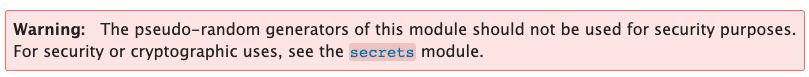

# Challenge #5 - Twisted Robot

Category: `misc` (but really, it's `crypto`)

## Story

>It’s a hot day, and your skin is cracking and dry. It’s difficult to make your way through the crowded bazaar. A high pitch voice pierces through the soundscape from a salesman that’s trying to sell colorful fabrics and then from another corner comes delicious smells. You spot a hand waving - it’s your contact that you’ve been waiting to meet. "Take a seat, my friend, I’m Gökhan, have you been to Istanbul before? No, really? I’m sure that you will have a great time, I’ve ordered tea for the two of us. Show me the amulet, will you?. Wow, this is really something from my younger days, this is as mysterious as it is beautiful and belongs to “The cloaked brotherhood”. They are very dangerous, and even though your quest is urgent, I would advise you to not continue looking for the owner of this. Go home, and forget about it." In the blink of an eye, four tough guys show up, and you start to run together with Gökhan through the crowded marketplace and then up on a rooftop. The tough guys are closing in, but the two of you climb down from the rooftop, run around a corner and are able to hide in two crates.<br/><br/>
>We found this old robo caller. It basically generates random phone numbers to spam. We found the last list of numbers in generated and also some weird file... Maybe it's got to do with these new beta features they were testing?

## Solution

This challenge comes with a download link. Let's fetch it and examine it:

```sh
$ wget -O twisted-robot.zip https://storage.googleapis.com/gctf-2021-attachments-project/8d19115532225f6ab25ed208e355b37d55476dfc2c1996cbe81f6e82c96f79a20756d5d53fac7f90bc7841aedab34d0686335bafcdbe2cf07333163719ecff9b
$ unzip ./twisted-robot.zip
Archive:  twisted-robot.zip
 extracting: RoboCaller1337.py
 extracting: robo_numbers_list.txt
 extracting: secret.enc
```

* `RoboCaller1337.py` - From the challenge description, we know this is code for a robo caller.
* `robot_numbers_list.txt` - This is a long list of previously-generated phone numbers. This must be useful somehow, otherwise why provide it.
* `secret.enc` - Presumably the flag, but encrypted somehow (probably by the robo-caller code).

What does running it do?

```sh
$ python ./RobotCaller1337.py
Welcome to the RoboCaller!! What would you like to do?
1: generate a new list of numbers
2: encrypt a super secret (in beta)
3: decrypt a super secret (coming soon!!)
4: exit
>
```

Great, it can encrypt and decrypt a "super secret". That's probably how we unlock `secret.enc`. However...

```sh
>3
stay tuned for this awesome feature
```

Oh well. It would've been too easy.

Let's go through the code in parts to understand what it does and look for a weakness.

## Analyzing the code

```python
import random
```

The only import. The code claims to encrypt super secrets, but the `random` module is probably not cryptographically secure (we have the built in [crypto](https://docs.python.org/3/library/crypto.html) imports for that, as well as many other third-party libraries). Let's come back to this later.

```python
# Gots to get that formatting right when send it to our call center
def formatNumber(n):
    n = str(n)
    return f'{n[:3]}-{n[3:6]}-{n[6:]}'
```

This just formats a phone number from an int. Looks harmless.

```python
# This generates random phone numbers because it's easy to find a lot of people!
# Our number generator is not great so we had to hack it a bit to make sure we can
# reach folks in Philly (area code 215)
def generateRandomNumbers():
    arr = []
    for i in range(624):
        arr.append(formatNumber(random.getrandbits(32) + (1<<31)))
    return arr
```

Now here's something interesting! There are several things of note here:

* They admit their number generator is "not great".
* They said they had to "hack it".
* They are generating numbers using the `random` module without any modification.
* They generate a suspiciously specific number of numbers, 624.

Let's remember this and keep going.

```python
def encodeSecret(s):
    key = [random.getrandbits(8) for i in range(len(s))]
    return bytes([a^b for a,b in zip(key,list(s.encode()))])
```

This also seems very relevant. They are simply XORing the secret with a key generated by getting more bits from the `random` module. This is probably connected somehow with the previous function.

```python
def menu():
    print("""\n\nWelcome to the RoboCaller!! What would you like to do?
1: generate a new list of numbers
2: encrypt a super secret (in beta)
3: decrypt a super secret (coming soon!!)
4: exit""")
    choice = ''
    while choice not in ['1','2','3']:
        choice = input('>')
        if choice == '1':
            open('robo_numbers_list.txt','w').write('\n'.join(generateRandomNumbers()))
            print("...done! list saved under 'robo_numbers_list.txt'")
        elif choice == '2':
            secret = input('give me your secret and I\'ll save it as "secret.enc"')
            open('secret.enc','wb').write(encodeSecret(secret))
        elif choice == '3':
            print("stay tuned for this awesome feature\n\n")
        elif choice == '4':
            print("Thank you for using RoboCaller1337!")
    return

def main():
    while True:
        menu()

if __name__ == "__main__":
    main()
```

Nothing of note here. It's just a menu.

## Looking for weaknesses

The most obvious weakness is the method of generating random bits used in the encryption of the secret. If we can recover the key, we can recover the original secret by XORing the encrypted value with it.

But where to look? Well, one common crypto flaw in general is using a [Pseudo-Random Number Generator (PRNG)](https://en.wikipedia.org/wiki/Pseudorandom_number_generator). Basically, if you can recover the state of a PRNG, you can then start predicting all the subsequent values. In this challenge we are given a long list of generated phone numbers, so maybe they can be used somehow to recover the PRNG state.

But wait, does Python even use a PRNG? Well, let's do a really dumb test:

```sh
$ python -c 'import random; print(random.getrandbits(32))'
382167559
$ python -c 'import random; print(random.getrandbits(32))'
1059587927
$ python -c 'import random; print(random.getrandbits(32))'
3011387458
```

Hmm, so at the very least importing `random` sets a new seed every time and doesn't need to be manually seeded.

Let's look at [the documentation](https://docs.python.org/3/library/random.html). Wait a second, what's this?



A-ha! The challenge does exactly this - use the PRNG for security purposes. Let's look further into it.

## Exploiting the Mersenne Twister

Earlier in the documentation it mentions that Python (3) uses a [Mersenne Twister](https://en.wikipedia.org/wiki/Mersenne_Twister). We are definitely on the right track since the challenge is called "Twisted" Robot.

The documentation also says it's "completely deterministic". That's great! So maybe we can "determine" the key that was used for the secret.

But how? What is the Mersenne Twister weak to? Let's Google around a bit.

After several variations on "python mersenne twister predict" or "crack", I found two promising tools:

* https://github.com/kmyk/mersenne-twister-predictor
* https://github.com/tna0y/Python-random-module-cracker

I happened to use `randcrack`, probably because it's the first one I found and it happened to work. So how do we use it?

>It is important to feed cracker exactly 32-bit integers generated by the generator. As well, you must feed the cracker exactly after new seed is presented, or after 624\*32 bits are generated since every 624 32-bit numbers generator shifts it's state and cracker is designed to be fed from the beginning of some state.

That's perfect! Assuming our intuition is correct, we have exactly 624 32-bit phone numbers generated right at the start of a state (after importing `random`).

The way we'd actually use this is by feeding the 624 phone numbers into the predictor, then predicting the key and trying to decrypt the secret. Technically the decryption will always "work", since we're just XORing some bits with other bits, but this is a CTF, so we know we've won when we see `CTF{` at the beginning.

### Decrypting the secret

Let's write some code:

```python
from randcrack import RandCrack

rc = RandCrack()

with open('robo_numbers_list.txt', 'r') as f:
  for line in f.readlines():
    # Undo the formatting and the bit shift.
    recovered = int(line.strip().replace('-','')) - (1<<31)
    
    # Feed the predictor.
    rc.submit(recovered)

# Now the moment of truth, try predicting and decoding.
recovered_bytes = []
with open('secret.enc','rb') as secret:
  while (byte := secret.read(1)):
    key = rc.predict_getrandbits(8)
    recovered_bytes.append(key ^ byte[0])

print(''.join([chr(b) for b in recovered_bytes]))
```

Running it happily gives us the flag:

```
CTF{n3v3r_3ver_ev3r_use_r4nd0m}
```
