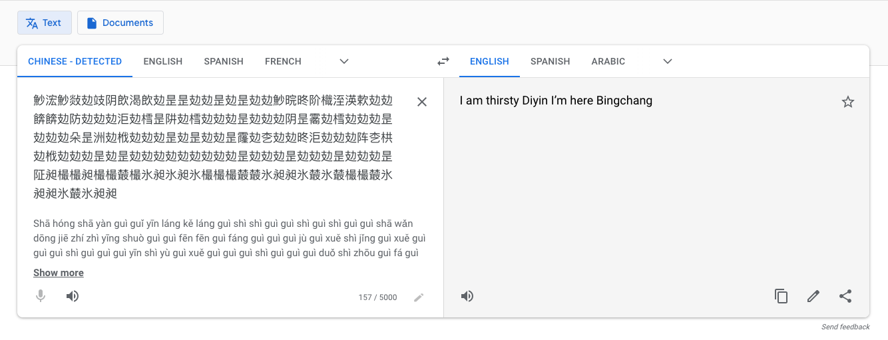
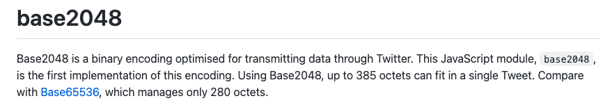
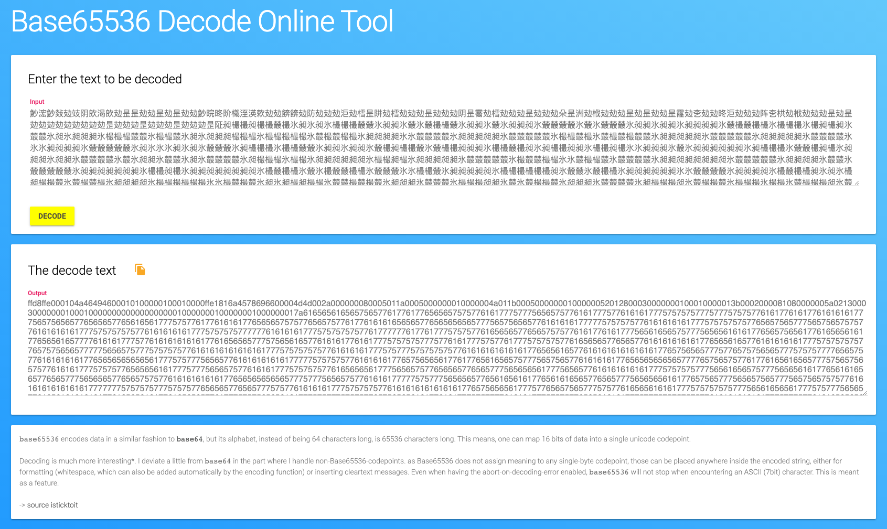

# Challenge #6 - To the Moon

Category: `misc`

## Story

>You’re exiting a crowded subway nearby the office that you are about to visit. You are showing the guards your ID and answering a couple of routine questions. They are not impressed, but the gate opens up and you can enter the area despite their doubt. You are not allowed to stroll freely on the company grounds, but are shown around by a woman that stares at you with a crooked smile. At last you're able to talk to the manager, a short man with a white robe and shades: "Greetings, AGENT, You must be thirsty after your long journey? No? You don’t mind if I’ll have something for myself, do you? Good! We have heard about the device that you possess, can I have a look at it. Hmm, it seems that it is encrypted. Help me break this quickly so that we can continue with the analysis."<br/><br/>
>This one is a doozie. We found this weird file on a memory stick with a post-it note on it. It looks like someone was working on a very obscure encryption system. Maybe we can decode it?

## Solution

>This one is a doozie

OH BOY they did not lie here. This was easily the most convoluted and guessy challenge of the entire CTF.

I personally helped 10x as many people through this one specific challenge as I did for any other. I suspect if anyone found this repo, it was to see this writeup here.

I'll give intuition where I can, but honestly I had several people help me and give me crucial nudges when I got stuck, so some of the steps will be "well you just have to guess right and have that flash of insight ¯\\\_(ツ)_/¯"

Let's begin the adventure.

## Preparation

This challenge comes with a download link. Let's fetch it and examine it:

```sh
$ wget -O to-the-moon.zip https://storage.googleapis.com/gctf-2021-attachments-project/306a5e3c0faa213b4b3348366938020f90d38a41ae136a46547553fb3d6961c4bf598da6378092b4afd60f60a2510898c59d1a091961f0729c4839b1a6266a8f
$ unzip to-the-moon.zip
Archive:  to-the-moon.zip
 extracting: chall.txt
 extracting: encodings
```

Let's look at the files and see what we're dealing with.

First, the encodings:

```
I made a super secret encoder. I remember using:
- a weird base, much higher than base64
- a language named after a painter
- a language that is the opposite of good
- a language that looks like a rainbow cat
- a language that is too vulgar to write here
- a language that ended in 'ary' but I don't remember the full name

I also use gzip and zlib (to compress the stuff) and I like hiding things in files...
```

Okay then. So the file `chall.txt` likely has to be transformed through each of these encodings before giving us the flag. Makes sense so far.

The encodings keep talking about various odd languages so it's safe assume these aren't going to be ordinary languages but [esolangs](https://esolangs.org/).

Let's do a bit of research on what each of these could mean. From now on, we'll keep running track of which encodings we've used, as presumably each is only used once.


* [ ] A weird base, much higher than base64 **(base128? base1024? higher?)**
* [ ] A language named after a painter **(probably [Piet](https://esolangs.org/wiki/Piet), first result from "esolang painter")**
* [ ] A language that is the opposite of good **(??? bad language? PHP? JavaScript? maybe "bad" isn't the right antonym here)**
* [ ] A language that looks like a rainbow cat **(nyan? [NyaScript](https://esolangs.org/wiki/NyaScript)?)**
* [ ] A language that is too vulgar to write here **(almost definitely certainly probably [Brainfuck](https://esolangs.org/wiki/brainfuck))**
* [ ] A language that ended in 'ary' but I don't remember the full name **(???)**
* [ ] gzip and zlib compression
* [ ] Data hidden in a file

Okay, so maybe research wasn't so helpful here. But we have at least a few pointers, so let's get started. Maybe the data will give more clues.

## Step 1: Starting File

Let's see what we have:

```sh
$ file chall.txt
chall.txt: DOS executable (COM)
```

It's almost certainly not actually a DOS executable. That wasn't one of the encodings, and I kind of just hope I don't have to figure out how to run a DOS exuctable in the year 2021.

```
$ cat chall.txt
魦浤魦敥攰攱阴欴渴欴攰昰昰攰攰昰攰昰攰攰魦晥昸阶樴洷渶欶攰攰餴餴攰防攰攰攰洰攰樰昰阱攰樰攰攰攰昰攰攰攰阴昰霱攰樰攰攰攰昰攰攰攰朵昰洲攰栰攰攰攰昰攰昰攰攰昰霳攰朰攰攰昸洰攰攰攰阵朰栱攰栰攰攰攰昰攰昰攰攰攰攰攰攰攰攰攰昰攰攰攰昰攰攰攰昰攰攰攰昰阷昶樶樶昶樶樶樷樶氷昶氷昶氷樶樶樶樷樷氷昶昶氷樷氷樷樶樶樷氷昶昶氷樷氷昶昶...
```

Oh.

It can't possibly be this simple, but let's throw the first few characters into Google Translate with "Detect language" on:



Wonderful.

Let's ignore the Chinese characters then. That's probably my poor undeserving shell's best attempt at parsing the bytes.

So which of the other encodings is it? It's naive to assume they're given in order, but honestly a high base encoding might make sense here.

Let's try a few bases in [Cyber Chef](https://gchq.github.io/CyberChef/) (a wonderful tool, especially for CTFs). Unfortunately, it only goes as high as base85, and that gives this error:

```
From Base85 - Invalid character '魦' at index 0
```

Okay. It does say _much_ higher after all.

I'm not familiar with encodings beyond base64, but knowing that we computer science people are nerds, I'm going to guess encodings go up in powers of two. Let's Google around:

* base128 - There's [this](https://stackoverflow.com/questions/6008047/why-is-base128-not-used) explaining why this is NOT a thing
* base256 - There's [this](https://github.com/aks-/base-256), but it doesn't really work
* base512 - Can't find anything from a quick search
* base1024 - Hmm, there's [ecoji](https://github.com/keith-turner/ecoji), but it also gives nonsense
* base2048 - Hmm, there's [this](https://github.com/qntm/base2048), but it also doesn't really work

But wait! What's this?



65536?! I've never even suspected an encoding with this many bits exist but why not, let's try it.

There is the [linked library](https://github.com/qntm/base65536), of course, (which I did in fact use in [decode.js](decode.js)), but Googling "base65536 decoder" also turns up the [BetterConverter Base65536 Decode Online Tool](https://www.better-converter.com/Encoders-Decoders/Base65536-Decode). Let's try it.



This looks more promising! Not only does it succeed, but you can kind of see a pattern in the hex. There's a funbh of values, then lots of 7s, 5s, 6s and 1s. Let's save our progress.

* [X] <strike>A weird base, much higher than base64 (base65536)</strike>
* [ ] A language named after a painter **(probably [Piet](https://esolangs.org/wiki/Piet), first result from "esolang painter")**
* [ ] A language that is the opposite of good **(??? bad language? PHP? JavaScript? maybe "bad" isn't the right antonym here)**
* [ ] A language that looks like a rainbow cat **(nyan? [NyaScript](https://esolangs.org/wiki/NyaScript)?)**
* [ ] A language that is too vulgar to write here **(almost definitely certainly probably [Brainfuck](https://esolangs.org/wiki/brainfuck))**
* [ ] A language that ended in 'ary' but I don't remember the full name **(???)**
* [ ] gzip and zlib compression
* [ ] Data hidden in a file

# Step 2: The base65536-decoded file

TODO


