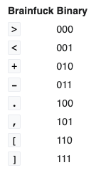

# Challenge #6 - To the Moon

Category: `misc`

## Story

>You’re exiting a crowded subway nearby the office that you are about to visit. You are showing the guards your ID and answering a couple of routine questions. They are not impressed, but the gate opens up and you can enter the area despite their doubt. You are not allowed to stroll freely on the company grounds, but are shown around by a woman that stares at you with a crooked smile. At last you're able to talk to the manager, a short man with a white robe and shades: "Greetings, AGENT, You must be thirsty after your long journey? No? You don’t mind if I’ll have something for myself, do you? Good! We have heard about the device that you possess, can I have a look at it. Hmm, it seems that it is encrypted. Help me break this quickly so that we can continue with the analysis."<br/><br/>
>This one is a doozie. We found this weird file on a memory stick with a post-it note on it. It looks like someone was working on a very obscure encryption system. Maybe we can decode it?

## Solution

>This one is a doozie

OH BOY they did not lie here. This was easily the most convoluted and guessy challenge of the entire CTF.

I personally helped 10x as many people through this one specific challenge as I did for any other. I suspect if anyone found this repo, it was to see this writeup here.

I'll give intuition where I can, but honestly I had several people help me and give me crucial nudges when I got stuck, so some of the steps will be "well you just have to guess right and have that flash of insight ¯\\\_(ツ)_/¯"

Let's begin the adventure.

## Preparation

This challenge comes with a download link. Let's fetch it and examine it:

```sh
$ wget -O to-the-moon.zip https://storage.googleapis.com/gctf-2021-attachments-project/306a5e3c0faa213b4b3348366938020f90d38a41ae136a46547553fb3d6961c4bf598da6378092b4afd60f60a2510898c59d1a091961f0729c4839b1a6266a8f
$ unzip to-the-moon.zip
Archive:  to-the-moon.zip
 extracting: chall.txt
 extracting: encodings
```

Let's look at the files and see what we're dealing with.

First, the encodings:

```
I made a super secret encoder. I remember using:
- a weird base, much higher than base64
- a language named after a painter
- a language that is the opposite of good
- a language that looks like a rainbow cat
- a language that is too vulgar to write here
- a language that ended in 'ary' but I don't remember the full name

I also use gzip and zlib (to compress the stuff) and I like hiding things in files...
```

Okay then. So the file `chall.txt` likely has to be transformed through each of these encodings before giving us the flag. Makes sense so far.

The encodings keep talking about various odd languages so it's safe assume these aren't going to be ordinary languages but [esolangs](https://esolangs.org/).

Let's do a bit of research on what each of these could mean. From now on, we'll keep running track of which encodings we've used, as presumably each is only used once.


* [ ] A weird base, much higher than base64 **(base128? base1024? higher?)**
* [ ] A language named after a painter **(probably [Piet](https://esolangs.org/wiki/Piet), first result from "esolang painter")**
* [ ] A language that is the opposite of good **(??? bad language? PHP? JavaScript? maybe "bad" isn't the right antonym here)**
* [ ] A language that looks like a rainbow cat **(nyan? [NyaScript](https://esolangs.org/wiki/NyaScript)?)**
* [ ] A language that is too vulgar to write here **(almost definitely certainly probably [Brainfuck](https://esolangs.org/wiki/brainfuck))**
* [ ] A language that ended in 'ary' but I don't remember the full name **(???)**
* [ ] gzip and zlib compression
* [ ] Data hidden in a file

Okay, so maybe research wasn't so helpful here. But we have at least a few pointers, so let's get started. Maybe the data will give more clues.

## Step 1: Starting File

Let's see what we have:

```sh
$ file chall.txt
chall.txt: DOS executable (COM)
```

It's almost certainly not actually a DOS executable. That wasn't one of the encodings, and I kind of just hope I don't have to figure out how to run a DOS exuctable in the year 2021.

```
$ cat chall.txt
魦浤魦敥攰攱阴欴渴欴攰昰昰攰攰昰攰昰攰攰魦晥昸阶樴洷渶欶攰攰餴餴攰防攰攰攰洰攰樰昰阱攰樰攰攰攰昰攰攰攰阴昰霱攰樰攰攰攰昰攰攰攰朵昰洲攰栰攰攰攰昰攰昰攰攰昰霳攰朰攰攰昸洰攰攰攰阵朰栱攰栰攰攰攰昰攰昰攰攰攰攰攰攰攰攰攰昰攰攰攰昰攰攰攰昰攰攰攰昰阷昶樶樶昶樶樶樷樶氷昶氷昶氷樶樶樶樷樷氷昶昶氷樷氷樷樶樶樷氷昶昶氷樷氷昶昶...
```

Oh.

It can't possibly be this simple, but let's throw the first few characters into Google Translate with "Detect language" on:


Wonderful.

Let's ignore the Chinese characters then. That's probably my poor undeserving shell's best attempt at parsing the bytes.

So which of the other encodings is it? It's naive to assume they're given in order, but honestly a high base encoding might make sense here.

Let's try a few bases in [Cyber Chef](https://gchq.github.io/CyberChef/) (a wonderful tool, especially for CTFs). Unfortunately, it only goes as high as base85, and that gives this error:

```
From Base85 - Invalid character '魦' at index 0
```

Okay. It does say _much_ higher after all.

I'm not familiar with encodings beyond base64, but knowing that we computer science people are nerds, I'm going to guess encodings go up in powers of two. Let's Google around:

* base128 - There's [this](https://stackoverflow.com/questions/6008047/why-is-base128-not-used) explaining why this is NOT a thing
* base256 - There's [this](https://github.com/aks-/base-256), but it doesn't really work
* base512 - Can't find anything from a quick search
* base1024 - Hmm, there's [ecoji](https://github.com/keith-turner/ecoji), but it also gives nonsense
* base2048 - Hmm, there's [this](https://github.com/qntm/base2048), but it also doesn't really work

But wait! What's this?


65536?! I've never even suspected an encoding with this many bits exist but why not, let's try it.

There is the [linked library](https://github.com/qntm/base65536), of course, (which I did in fact use in [decode.js](decode.js)), but Googling "base65536 decoder" also turns up the [BetterConverter Base65536 Decode Online Tool](https://www.better-converter.com/Encoders-Decoders/Base65536-Decode). Let's try it.


This looks more promising! Not only does it succeed, but you can kind of see a pattern in the hex. There's a funbh of values, then lots of 7s, 5s, 6s and 1s. Let's save our progress.

**The file is [chall.base65536_decoded](chall.base65536_decoded)**

* [X] <strike>A weird base, much higher than base64</strike> (base65536)
* [ ] A language named after a painter
* [ ] A language that is the opposite of good
* [ ] A language that looks like a rainbow cat
* [ ] A language that is too vulgar to write here
* [ ] A language that ended in 'ary' but I don't remember the full name
* [ ] gzip and zlib compression
* [ ] Data hidden in a file

# Step 2: The base65536-decoded file

So what are we actually looking at? It's hex bytes, so I tried putting it in Cyber Chef with "From Hex", which appears to work! We see the string ["JFIF"](https://en.wikipedia.org/wiki/JPEG_File_Interchange_Format) appear early on, so let's save this as the file [chall.base65536_decoded.png](chall.base65536_decoded.png). Sure enough, this is recognized as an image:

```sh
$ file chall.base65536_decoded.png
chall.base65536_decoded.png: JPEG image data, JFIF standard 1.01, aspect ratio, density 1x1, segment length 16, Exif Standard: [TIFF image data, big-endian, direntries=5, xresolution=74, yresolution=82, resolutionunit=1], baseline, precision 8, 1131x707, components 3
```


Hmm, this looks familiar. Where have we seen something like this during research? Oh, right! It looks like a Piet drawing. That is indeed one of the hints as well! So we win, right?

Right?

Well not so fast. On [npiet](https://www.bertnase.de/npiet/npiet-execute.php), it fails to execute:

```
cannot read from `npiet-execute/chall.base65536_decoded.png'; reason: unknown PPM format
```

[Pyet](https://github.com/jdherg/pyet) fails similarly.

So this is a red herring, meant to throw us off the trail and foil our brave efforts to decode the secret. What do we do now?

Wait a second, what's this in the clues...

```
I like hiding things in files...
```

Do you now? This is an image, and images have metadata. It's common in CTFs to put interesting info there. Surely not...

```
$ exiftool chall.base65536_decoded.png
ExifTool Version Number         : 12.30
File Name                       : chall.base65536_decoded.png
Directory                       : .
File Size                       : 85 KiB
File Modification Date/Time     : 2021:09:19 20:51:54-04:00
File Access Date/Time           : 2021:09:19 20:57:30-04:00
File Inode Change Date/Time     : 2021:09:19 20:51:54-04:00
File Permissions                : -rw-r-----
File Type                       : JPEG
File Type Extension             : jpg
MIME Type                       : image/jpeg
JFIF Version                    : 1.01
Exif Byte Order                 : Big-endian (Motorola, MM)
X Resolution                    : 1
Y Resolution                    : 1
Resolution Unit                 : None
Artist                          : zaeeaeeuewawaweeeuuwaawuwueeuwaawuwaaawuuuuwuwuuuwaawaawaaaawueueeweeeweaeawuuwawaaaweeeuuweeuwawaaaeeeweeeeewueueewaaaawwuuuuwaaaaawuuu...
...
```

Well now! This looks like what we're actually looking for. It goes on for many many lines and clearly has a pattern, consisting only of the lettes `zaeuw`. Let's take another break.

**The file is [chall.from_artist](chall.from_artist)**

* [X] <strike>A weird base, much higher than base64</strike> (base65536)
* [ ] A language named after a painter
* [ ] A language that is the opposite of good
* [ ] A language that looks like a rainbow cat
* [ ] A language that is too vulgar to write here
* [ ] A language that ended in 'ary' but I don't remember the full name
* [ ] gzip and zlib compression
* [X] <strike>Data hidden in a file</strike> (hidden in the Artist tag of an image)

## Step 3: The Artist string

Okay, so what are we looking at here? How do you Google for "esolang zaeuw"? `file` is kind of useless:

```sh
$ file chall.from_artist
chall.from_artist: ASCII text, with very long lines
```

Well, the least we can do is the process of elimination. Let's look through the remaining clues:

* It's definitely not Piet (it has to be an image).
* It may be the "opposite of good" esolang.
* It's probably not Nyan. If someone goes through the trouble of creating a Nyan-based language, you'd expect to see "nyan" in the syntax.
* It's not Brainfuck. I know what that looks like and it's all symbols, not letters.
* It's probably not the -ary language. This is a stretch but I would assume it's something like binary, trinary, quarternary, etc. and it would be based on the number of bits, but this has a clear character set.

So let's close our eyes, spin around for 30s and go where we point. Let's try to find the "opposite of good" language.

I have to admit I spun wheels here for hours. There are so many possible avenues to explore and I just could not think of a different antonym that made sense. [Googling it](https://www.wordhippo.com/what-is/the-opposite-of/good.html) leads me to "wicked", "disadvantaged", "terrible", and all other sorts of words. It wasn't until a former sufferer nudged me with the following: "The forces of good and ... ?"

[Evil](https://esolangs.org/wiki/Evil)! It fits. All the letters we see are commands in this language. Let's try it.

But how? We could write our own interpreter based on the wiki, but I have to believe someone has done it already. The challenge author wouldn't be so cruel as to make us have to successfully implement an obscure esolang.

At the bottom of the wiki are several links, one of them to the [evil homepage on the Wayback Machine](http://web.archive.org/web/20070103000858/www1.pacific.edu/~twrensch/evil/index.html). This actually has a [Java implementation](http://web.archive.org/web/20070906133127/http://www1.pacific.edu/~twrensch/evil/evil.java) which you can run (albeit with an older JDK) and it will succeed.

Well, as I learned, there also exists [esolang-box](https://github.com/hakatashi/esolang-box). In fact, this also explains why "evil" was chosen - it's literally the first example given. Let's try it.

```sh
$ docker run -v `pwd`:/code:ro esolang/evil evil /code/chall.from_artist
srcPos .. 0 (chr z)
whlPos .. 0 ,val 0
srcPos .. 1 (chr a)
whlPos .. 0 ,val 0
srcPos .. 2 (chr e)
whlPos .. 0 ,val 0
srcPos .. 3 (chr e)
whlPos .. 0 ,val 0
...
```

Err..what?

Looking through it a bit more shows a bunch of `chr` and `val` lines. This is probably the `w` command - "Writes A to output, as a character". Let's try to filter for this.

Wait, let's actually try writing the output to a file. Maybe we're seeing the outputs of `stderr` and `stdout` mingling:

```sh
$ echo "$(docker run -v `pwd`:/code:ro esolang/evil evil /code/chall.from_artist)" > ./chall.from_evil
<same logging as before>
$ cat chall.from_evil
789ced57695413591a7569c56e9155161d050511150111230a024d9b800328e368435340a28050dd519486180810daa...
```

Hey, what do you know, it worked. Well probably. There are some hex-y looking bytes here, which is probably correct. Let's save our progress.


**The file is [chall.from_evil](chall.from_evil)**

* [X] <strike>A weird base, much higher than base64</strike> (base65536)
* [ ] A language named after a painter
* [X] <strike>A language that is the opposite of good</strike> ([evil](https://esolangs.org/wiki/Evil))
* [ ] A language that looks like a rainbow cat
* [ ] A language that is too vulgar to write here
* [ ] A language that ended in 'ary' but I don't remember the full name
* [ ] gzip and zlib compression
* [X] <strike>Data hidden in a file</strike> (hidden in the Artist tag of an image)


## Step 4: The evil output

Let's un-hex our last file and see what we're dealing with.

```sh
$ xxd -r -p chall.from_evil chall.from_evil_decoded
$ file chall.from_evil_decoded
chall.from_evil_decoded: zlib compressed data
```

Oh merciful forces, it's just plain zlib-compressed data. A surprise, to be sure, but a welcome one.

Let's decompress it with [`pigz`](http://zlib.net/pigz/):

```sh
$ mv chall.from_evil_decoded chall.from_evil_decoded.zlib
$ pigz -d <chall.from_evil_decoded.zlib >chall.from_evil_decoded.unknown
$ file chall.from_evil_decoded.unknown
evil-output.gz: gzip compressed data, last modified: Thu Jul 15 08:21:18 2021, max compression, original size modulo 2^32 701584
```

Awesome, another easy one. Let's gzip-decompress it:

```sh
$ mv chall.from_evil_decoded.unknown chall.from_evil_decoded.gz
$ gzip -k -d chall.from_evil_decoded.gz
$ file chall.from_evil_decoded
chall.from_evil_decoded: Netpbm image data, size = 1827 x 128, rawbits, pixmap
```

This looks like something else. Let's save our progress.


**The file is [chall.from_evil_decoded](chall.from_evil_decoded)**

* [X] <strike>A weird base, much higher than base64</strike> (base65536)
* [ ] A language named after a painter
* [X] <strike>A language that is the opposite of good</strike> ([evil](https://esolangs.org/wiki/Evil))
* [ ] A language that looks like a rainbow cat
* [ ] A language that is too vulgar to write here
* [ ] A language that ended in 'ary' but I don't remember the full name
* [X] <strike>gzip and zlib compression</strike>
* [X] <strike>Data hidden in a file</strike> (hidden in the Artist tag of an image)

## Step 5: The evil image

[Netpbm](https://en.wikipedia.org/wiki/Netpbm) is an set of graphics programs, it seems. They take PPM, PGM or PBM image formats.

Why does this sound so familiar...

```
cannot read from `npiet-execute/chall.base65536_decoded.png'; reason: unknown PPM format
```

Oh right, the last time we tried to interpret a Piet program the error said it was looking for a PPM format. Well, this sounds like a clue.

Let's save it as an image and try to run it on [npiet](https://www.bertnase.de/npiet/npiet-execute.php):

```
$ cp chall.from_evil_decoded chall.from_evil_decoded.png
<after running on netpiet>
789ce5d9bb11c3300c83e13e5b7a81f4693c7b7630ee807c91fbff288b141fe0fbf3e4bbeed7bb073eb616a121bdb01cd9ecfab48d2d820872e2e05643fa39db0ef40c1efc673772db3f3809badfbf50f1254fe9d12f97f348b94a4b6f1af262022fcaa5514990b718b2569e43826ee10e8b6c1beda7b97a0d60f2a334e44fed561d2339859b6628796038ef2d0cb745eb886ebf36a71a252823e56ec2ceaa7f83f16b9630cf12d72c693f6095e1288347cd0dd576929d9867ba1f8acc2061e5bf81cd43ee07a96521bad8dc381a11a431e6b4d76d4a7bc71599d094882c0512f84ea5f13760c5fc1bc283acd40d08ee62fb814fed0446b497523419f048cb44eb21cdfc88ee68593ca68ad64fbaf28a5858ea2518197a0871dd711e719d9c764b343a0939da39692b8780563a2d610a27a72cf2d0bb678668f0deaecc186a37a0b58ac9e1aede608cc3963342d67a29ccb401f4508a0f525ac9561919d2d04a2aa1275b4d4ae71ce8c013a7385a50866a119fc19bbf554a30b195844628ee89808dc902a6127c084375d0d8f80d9f8aa160520ac9e6b0d2c090b3ccf8c825e951bda78e7b44e7ff9c95d4b3912f076b06af91d754e304ee47f0ff778d3ba34a6b73dd5f8feb8435
warning: pop failed: stack underflow

warning: pop failed: stack underflow

warning: pop failed: stack underflow

warning: pop failed: stack underflow

warning: pop failed: stack underflow

warning: pop failed: stack underflow

warning: pop failed: stack underflow

warning: 100 thousand warnings shown - stopping this...
error: configured execution steps exceeded (2228 steps)
```

Eh, warnings aren't errors, even 100 thousand of them. Let's save the value to [chall.from_piet](chall.from_piet) and un-hex it:

```sh
$ xxd -r -p chall.from_piet chall.from_piet_decoded
$ file chall.from_piet_decoded
chall.from_piet_decoded: zlib compressed data
```

Nice. Let's unwrap it the same as before.

```sh
$ mv chall.from_piet_decoded chall.from_piet_decoded.zlib
$ pigz -d <chall.from_piet_decoded.zlib >chall.from_piet_decoded.unknown
$ file chall.from_piet_decoded.unknown
chall.from_piet_decoded.unknown: ASCII text
```

This seems like a good point to stop and save our progress once more.

**The file is [chall.from_piet_decoded.unknown](chall.from_piet_decoded.unknown)**

* [X] <strike>A weird base, much higher than base64</strike> (base65536)
* [X] <strike>A language named after a painter</strike> ([Piet](https://esolangs.org/wiki/Piet))
* [X] <strike>A language that is the opposite of good</strike> ([evil](https://esolangs.org/wiki/Evil))
* [ ] A language that looks like a rainbow cat
* [ ] A language that is too vulgar to write here
* [ ] A language that ended in 'ary' but I don't remember the full name
* [X] <strike>gzip and zlib compression</strike>
* [X] <strike>Data hidden in a file</strike> (hidden in the Artist tag of an image)


## Step 6: The Piet output

We've been going for a while. How much more could there be?

With a weary sigh, let's look at the file.

```sh
$ file chall.from_piet_decoded.unknown
chall.from_piet_decoded.unknown: ASCII text
```
Great.

```sh
$ head chall.from_piet_decoded.unknown
nyyyyyyyyyyyyyyyyyyyyyyyyyyyyyyyyyyyyyyyyyyyyyyyyyyyyya~
nyyyyyyyyyyyyyyyyyyyyyyyyyyyyyyyyyyyyyyyyyyyyyyyyyyyyya~
nyyyyyyyyyyyyyyyyyyyyyyyyyyyyyyyyyyyyyyyyyyyyyyyyya~
nyyyyyyyyyyyyyyyyyyyyyyyyyyyyyyyyyyyyyyyyyyyyyyyyyyyyyyya~
nyyyyyyyyyyyyyyyyyyyyyyyyyyyyyyyyyyyyyyyyyyyyyyyyyyyyyyyyyya~
nyyyyyyyyyyyyyyyyyyyyyyyyyyyyyyyyyyyyyyyyyyyyyyyyyyyyyyyya~
nyyyyyyyyyyyyyyyyyyyyyyyyyyyyyyyyyyyyyyyyyyyyyyyyyyyyyyyyyya~
nyyyyyyyyyyyyyyyyyyyyyyyyyyyyyyyyyyyyyyyyyyyyyyyyyya~
nyyyyyyyyyyyyyyyyyyyyyyyyyyyyyyyyyyyyyyyyyyyyyyyyyyyyyyyyya~
nyyyyyyyyyyyyyyyyyyyyyyyyyyyyyyyyyyyyyyyyyyyyyyyyyyyyya~
```

Interesting. There's an obvious pattern here, and it's safe to assume it's some kind of simplistic esolang.

Looking at our remaining clues, there's only one thing it could be: Rainbow Cat.


I initially Googled "esolang nyan" but I soon realized (after discussing with others on Discord) that this language never has the final "n", it's only ever "nya" and "~". Googling "esolang nya" lands us on [`nya~`](https://esolangs.org/wiki/Nya~).

Naturally probably practically no one has heard of this language. There's an implementation at the bottom, but I took another look at the (very small number of) commands and realized something.

Every line is just one `n`, a bunch of `y`s, and a command to output a char. That boils down to counting the `y`s - 1 and converting that to chr. Let's do it:

```sh
$ cp chall.from_piet_decoded.unknown chall.nyan
$ python -c 'for line in open("chall.nyan").readlines(): print(chr(line.count("y") - 1), end="")' > chall.from_nyan
$ file chall.from_nyan
chall.from_nyan: ASCII text, with very long lines
$ head chall.from_nyan
440697918422363183397548356115174111979967632241756381461523275762611555565044345243686920364972358787309560456318193690287799624872508559490789890532367282472832564379215298488385593860832849627398865422864710999039787979733217240717198641619578634620231344233376325369569117210379679868602299244468387044128773681334105139544596909148571184763654886495124023818825988036876333149722377075577809087358356951704469327595398462722928801
```

This is probably our next value, but let's save our progress.


**The file is [chall.from_nyan](chall.from_nyan)**

* [X] <strike>A weird base, much higher than base64</strike> (base65536)
* [X] <strike>A language named after a painter</strike> ([Piet](https://esolangs.org/wiki/Piet))
* [X] <strike>A language that is the opposite of good</strike> ([evil](https://esolangs.org/wiki/Evil))
* [X] <strike>A language that looks like a rainbow cat</strike>
* [ ] A language that is too vulgar to write here
* [ ] A language that ended in 'ary' but I don't remember the full name
* [X] <strike>gzip and zlib compression</strike>
* [X] <strike>Data hidden in a file</strike> (hidden in the Artist tag of an image)

## Step 7: The rainbow cat output

What are we even looking at here? It's plain text, but it's all numbers. It doesn't look like hex and un-hexing it in CyberChef doesn't produce anything.

There are precious few clues left. This is clearly not Brainfuck, so let's focus on the last remaining clue - the "-ary" language.

The [esolangs Language List](https://esolangs.org/wiki/Language_list) gives us 15 results. Sigh. Let's explore:

* Almost Binary - Just seems like a nicer binary.
* Binary - Maybe, but the commands are only binary 0-3 and our file doesn't match.
* B1nary - Commands are words, doesn't match.
* Noobinary - Maybe? But reading the description, I'd expect to see a lot more 1s in our file.
* Rotary - Mentions Brainfuck but uses similar notation, so it doesn't match.
* tuplary - Only uses brackets and spaces
* Unary Filesystem - An OS, not a language.
* Your Minsky May Vary - Uses totally different notation, not just numbers.

(I later discovered this page is nowhere near complete, and the actual intended language isn't on it)

### Despair

This is where I and everyone got utterly stuck. You practically NEED help to divine what's supposed to happen next.

I'm sad to admit I had no clue how to progress until I got this nudge:

```
Try different bases, look for a pattern. 
```

And so I did.

### Hope?

After much time on CyberChef trying out every base and squinting hard, I noticed something peculiar. "To Base: 8" gives the following output:

```
16370637122222260222222222213702222222412602222222222137022222224126033333333331370333341222226022222222221370222412603333333333137034160333333333313703333412222260333333333313703333333416022222222221370241222222602222222222137022241222222603333333333137033334122226022222222221370222241260222222222213702222241222222603333333333137033412222602222222222137022222224126022222222221370222241222222603333333333137034160222222222213702222412222226022222222221370224126022222222221370241
```

Why is this peculiar? Becuase I've seen Brainfuck before, and I know it often has long runs of `-----` or `+++++`, and here I see similar runs of `22222` and `33333`. Could this be Brainfuck represented in base8? It's a long shot but let's explore it, why not. Nothing else has worked so far.

Googling "base 8 brainfuck esolang" actually does gives some results. And wouldn't you know it, one of those is [Unary](https://esolangs.org/wiki/Unary), an -ary language! Now, the language itself is kind of silly (it's entirely 0s), but there's a crucial piece of information at the top:



This is a mapping of 3 bits to Brainfuck commands. That coincides with my observation of runs of numbers in base 8, which is 3 bits.

### Is this loss?

I think we've got it here. Let's convert it to Brainfuck and try it. I wrote a short Python script:

```python
num = int(open('chall.from_nyan').read().strip())
numbin = format(num, 'b')

commands = [numbin[i:i+3] for i in range(0, len(numbin) - 2, 3)]

for command in commands:
  bf =  {
    '000': '>',
    '001': '<',
    '010': '+',
    '011': '-',
    '100': '.',
    '101': ',',
    '110': '[',
    '111': ']',
  }[command]
  print(bf, end='')
```

```
$ python to_brainfuck.py >chall.brainfuck
$ cat chall.brainfuck
]<].-<].,<<<<<-><<<<<<<<<<>,].<<<<<<<+>,-><<<<<<<<<<>,].<<<<<<<+>,-><,,,,,,,,,.,].<,,,[>,<<<<-><<<<<<<<<<>,].<<<+>,-><,,,,,,,,,.,].<[>]><,,,,,,,,,.,].<,,,[>,<<<<-><,,,,,,,,,.,].<,,,,,,[>]><<<<<<<<<<>,].<+>,<<<<<-><<<<<<<<<<>,].<<<+>,<<<<<-><,,,,,,,,,.,].<,,,[>,<<<-><<<<<<<<<<>,].<<<<+>,-><<<<<<<<<<>,].<<<<<+>,<<<<<-><,,,,,,,,,.,].<,[>,<<<-><<<<<<<<<<>,].<<<<<<<+>,-><<<<<<<<<<>,].<<<<+>,<<<<<-><,,,,,,,,,.,].<[>]><<<<<<<<<<>,].<<<<+>,<<<<<-><<<<<<<<<<>,].<<+>,-><<<<<<<<<<>,].<+>
```

Let's run it in [copy.sh/brainfuck/](https://copy.sh/brainfuck/):

```
Syntax error: Unexpected closing bracket in line 1 char 0.
```

Well fuck.

## Step 8: [Sweet Victory](https://www.youtube.com/watch?v=cUZNXgIXM1c)

What went wrong here? Well I went to read the Unary specification in detail, and I found a sentence I missed earlier:

```
3. Place these commands behind each other, and put an extra "1" in front
```

Interesting. So if we are indeed looking at Unary code, then when converting we need to ignore the 1 at the front. Let's correct our code (see [to_brainfuck.py](to_brainfuck.py)) and re-run it:

```
$ python to_brainfuck.py >chall.brainfuck
$ cat chall.brainfuck
>[-]>[-]<++++++[>++++++++++<-]>+++++++.<+[>++++++++++<-]>+++++++.<+[>----------<-]>----.<+++++[>++++++++++<-]>+++.<+[>----------<-]>-.<[>----------<-]>----.<+++++[>----------<-]>-------.<[>++++++++++<-]>+.<++++++[>++++++++++<-]>+++.<++++++[>----------<-]>----.<++++[>++++++++++<-]>++++.<+[>++++++++++<-]>+++++.<++++++[>----------<-]>--.<++++[>++++++++++<-]>+++++++.<+[>++++++++++<-]>++++.<++++++[>----------<-]>-.<[>++++++++++<-]>++++.<++++++[>++++++++++<-]>++.<+[>++++++++++<-]>+.<
```

This looks more promising. Let's run it.

The flag couldn't be more appropriate:

```
CTF{pl34s3_n0_m04r}
```
